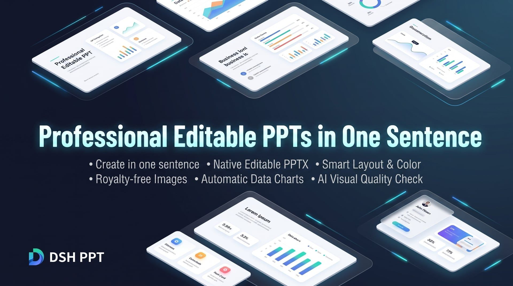

# DSH PPT · Turn Ideas into Editable Presentations

[中文](README.md) | **English**

<p align="center">
  
</p>

<p align="center">
  
  &nbsp;
  
  &nbsp;
  
  &nbsp;
  
</p>
<p align="center">
  <strong>An AI Presentation Assistant for Professionals Powered by DeepSeek Harness</strong><br>
  <em>One-prompt generation · Native editable PPTX · Smart layout & palette · Free commercial images · Auto data charts · AI visual quality review</em>
</p>

<p align="center">

[Highlights](#highlights) · [Quick Start](#quick-start) · [Use Cases](#use-cases) · [Output Files](#output-files) · [Multi-Agent Workflow](#multi-agent-workflow) · [FAQ](#faq) · [License](#license)

</p>

## Highlights

Tired of spending hours searching for templates, aligning text boxes, and tweaking layouts? Most AI PPT tools either output flattened, uneditable image slides or rigid, generic templates.

**DSH PPT brings presentation making back to what matters — your content:**

- 📝 **Truly Native & Editable**: Generates standard `.pptx` files rather than whole-page images. Texts, shapes, and charts can be freely edited and adjusted in Microsoft PowerPoint, Apple Keynote, or WPS.
- 🎨 **Professional Aesthetics & Layouts**: No more cookie-cutter templates. AI intelligently tailors color schemes, typography hierarchies, and page compositions for a polished business look.
- 📈 **Smart Charts & Curated Visuals**: Automatically searches for royalty-free commercial images and plots high-resolution data charts using Python, replacing walls of text with engaging visuals.
- 👁️ **AI Closed-Loop Visual Review**: The AI renders and visually inspects the generated PPT, proactively detecting and fixing text overflows, overlapping elements, or layout flaws.
- 🔒 **Local Safety & Privacy**: Generation and rendering run securely in local sandboxes, keeping clear records of asset licensing and sources for confident business use.

## Quick Start

### 1. Prerequisites

- **DeepSeek Harness 0.2.0-rc.2 or newer** (this plugin declares the DSH peer range `^0.2.0-rc.2`; a mismatched runtime refuses to load it)
- Any of the following office software installed locally (for high-fidelity rendering and visual review):
  - **macOS**: Keynote or Microsoft PowerPoint
  - **Windows**: Microsoft PowerPoint
  - **Cross-platform / Linux**: LibreOffice

### 2. Installation

Run the following commands to install the plugin directly from npm:

```bash
# Install directly via DSH plugin manager
dsh plugin --profile web add @yejiming/dsh-ppt
dsh plugin --profile headless add @yejiming/dsh-ppt
```

### 3. Start Creating

#### Option 1: Web Interface (Recommended)
Launch the Web console, create a new session, choose **"PPT Mode"**, and describe your requirements to the AI just like speaking with a designer:
```bash
dsh --profile web
```

#### Option 2: Headless Command Line
Generate a full deck directly with a single command:
```bash
dsh --profile headless "Create a 6-page AI project quarterly review and roadmap deck for management"
```

## Use Cases

| Category | Example Prompt |
| :--- | :--- |
| 📊 **Business Review / Debrief** | *"Create a 6-page Q3 e-commerce review deck highlighting GMV growth, funnel conversion, and next quarter strategy."* |
| 💼 **Pitch Deck / Proposal** | *"Draft an 8-page enterprise private AI knowledge base proposal deck with a sleek business-tech aesthetic."* |
| 📢 **Product Launch** | *"Design a product launch deck for a new mobile app, emphasizing key selling points and UX highlights."* |
| 🎓 **Training / Team Guidelines** | *"Create a 5-page agile development & team collaboration handbook deck with a clean, lively style."* |

## Output Files

Each completed task creates a standalone folder inside `ppt-output/`:

- 📄 **`deck.pptx`**: The final native PPT file. Double-click to open in PowerPoint, Keynote, or WPS for presentation or direct editing.
- 🖼️ **`preview/`**: High-resolution image previews of each slide, convenient for quick mobile browsing and sharing.
- 📁 **`assets/`**：Image assets and charts used in the deck, complete with attribution and license tracking.

## Multi-Agent Workflow

A deck can also be produced by several agents working in parallel: one scouting images, one gathering source material, one authoring the frame (outline + Art Direction), and a lead agent that integrates, verifies, and delivers the PPTX. The plugin supplies a fixed 20-tool surface and a strictly validated artifact contract; the split itself is arranged at the session layer.

- 🔍 **Image scout**: writes image candidates into a candidate pool only, never into the artifact directory. Searching and freezing are separate steps — freezing belongs to the lead agent.
- 📚 **Research agent**: writes sourced notes and structured data points only.
- 🧭 **Frame agent**: produces the outline payload and Art Direction only; it creates no deliverable files.
- 🎯 **Lead agent**: exclusively owns `ppt_outline` / `html_create` / `ppt_create` / `ppt_image`, and follows the gate order `outline → html → pptx → re-render → per-page review → finalize`.

Roles, inputs and outputs, write boundaries (who writes `outline.json`, who writes `deck.html`, who only produces a candidate list), dependency order, and failure fallbacks — including the real case of "image sources unavailable → fall back to a zero-external-link vector design" — are documented in **[Multi-Agent Workflow](docs/agent-workflow.md)** (the document is written in Chinese).

## FAQ

<details>
<summary><b>Q: Will the generated PPT have missing fonts or broken layouts in Office / WPS?</b></summary>
No. The system incorporates multi-platform fallback font strategies (prioritizing common fonts like Segoe UI, Helvetica, PingFang, and Source Han), ensuring consistent and aesthetic typography across devices.
</details>

<details>
<summary><b>Q: Can I export the slides to PDF or present directly?</b></summary>
Yes! The output is a standard <code>.pptx</code> file. You can enter presenter mode in PowerPoint, Keynote, or WPS, or export directly to PDF or speaker notes.
</details>

<details>
<summary><b>Q: How can I adjust slides if I want changes?</b></summary>
You have two flexible options:
1. **Chat with AI**: Ask the AI directly in the conversation (e.g., "Change slide 3 to a bar chart comparison", "Switch theme color to navy blue");
2. **Edit Locally**: Open <code>deck.pptx</code> directly and modify text, swap images, or tweak layouts like any standard slide deck.
</details>

## License

This project is licensed under the [MIT License](LICENSE).
